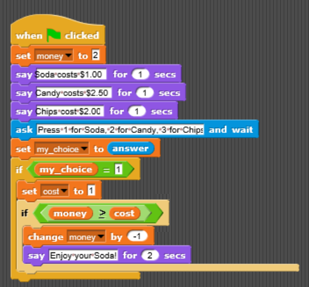

# Lesson 2.04: Conditionals

## Learning Objectives
Students will be able to... 
* Define and identify: **if, else, elif, conditionals, flow of control** 
* Create chaining if statements
* Understand how conditional statements alter the flow of control of a program

## Materials/Preparation
* [Do Now]
* [Lab - Game Show]
* Solution (access protected resources by clicking on "Additional Curriculum Materials" on the [TEALS Dashboard])
* Associated Reading - section 2.3 of Book
* Read through the do now, lesson, and lab so that you are familiar with the requirements and can assist students

## Pacing Guide
| **Duration**   | **Description** |
| ---------- | ----------- |
| 5 Minutes  | Do Now      |
| 10 Minutes | Lesson      |
| 35 Minutes | Lab         |
| 5 Minutes | Debrief  |

## Instructor's Notes
### 1. Do Now

* Project the Do Now on the board, circulate around the class to check that students are working and understand the instructions. 
* Students should quickly realize that they do not have all the tools necessary to complete the task.
  
### 2. Lesson
#### Instruction
* Ask students what they felt like they needed that they had in Snap!
* Explain that in order to write useful programs, we almost always need the ability to check conditions and change the behavior of the program accordingly. 
* **Conditional** statements give us this ability to affect the **flow of control**. 
* The simplest form is the `if` statement. The boolean expression after `if` is called the condition. If it is true, then the indented statement gets executed. If not, nothing happens.


    ```python
    if x > 0: 
        print("x is positive")
    ```

#### Demonstration
* Write out the syntax of the `if` statement on the board. Point out the Boolean expression(condition), the colon, and the indentation. 
* Ask students if they recall what else went along with the if statement when they used it in Snap! 
* `else` is used when there are two possibilities and the condition determines which one gets executed.
* Demonstrate the syntax of `else`
* Describe the `elif` statement
* Sometimes there are more than two possibilities and we need more than two branches. One way to express a computation like that is a chained conditional:
* Demonstrate the syntax of `elif`

### 3. Lab
* Students convert the triangle program written in Snap! into Python. 
* Students must also write a program that simulates a list index using `if` statements. 
### 4. Debrief
* Check student progress and completion of the lab, wrap up by taking any final questions.
* Have students write down a couple of learnings that they stood out to them today in their notebooks.


## Accommodation/Differentiation
Use the following as an extension activity for students that are moving quickly:
* Convert and finish the following SNAP Vending Machine program in Python.




If students are moving quickly, this lesson can move onto lists. 

## Forums discussion
[Lesson 2.04: Conditionals (TEALS Discourse Account Required)](https://forums.tealsk12.org/c/2nd-semester-unit-2/lesson-2-04-conditionals)


[Do Now]:do_now.md
[Lab - Game Show]:lab.md
[TEALS Dashboard]:http://www.tealsk12.org/dashboard
